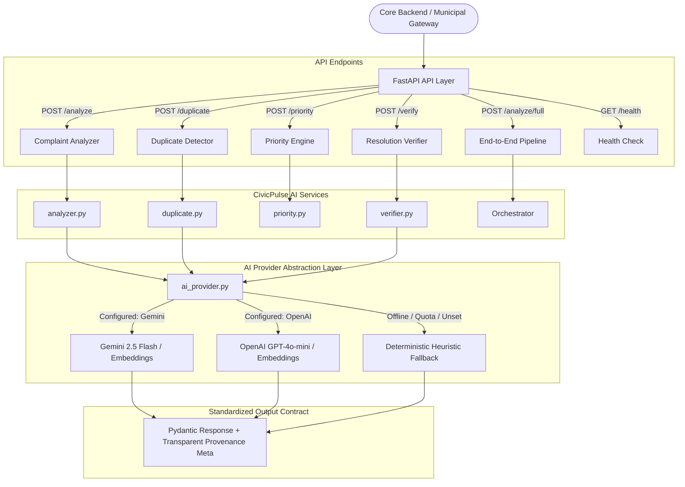
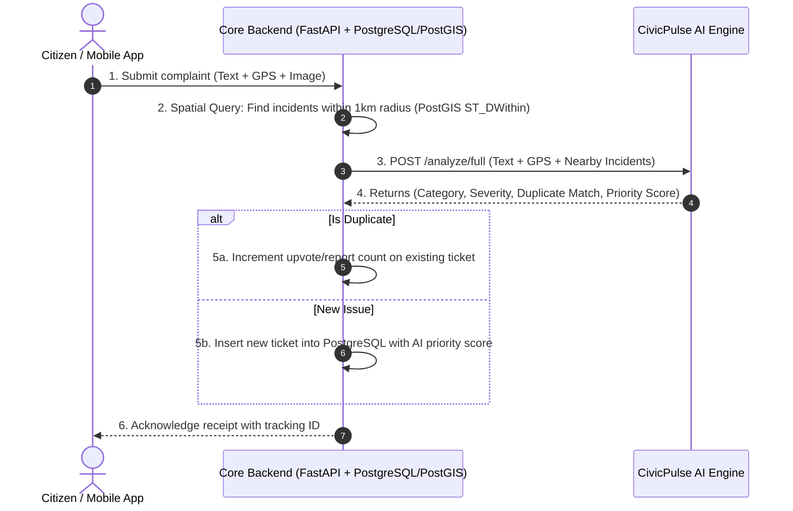

# 🏛️ CivicPulse — End-to-End System

> **AI-Powered Municipal Infrastructure Intelligence & Operations Platform**  
> *Transforming unstructured citizen signals into verified, deduplicated, and prioritized municipal actions.*

---

## 🚀 End-to-End Architecture & Quickstart

CivicPulse is composed of three decoupled, independently runnable layers:

```
    ┌──────────────────────────────────────────────┐
    │       CivicPulse Frontend (:3000)            │
    │  (Modular React 18 / Replaceable Client)     │
    └──────────────────────┬───────────────────────┘
                           │ REST / JSON API
                           ▼
    ┌──────────────────────────────────────────────┐
    │       CivicPulse Core Backend (:8000)        │
    │  FastAPI Public Gateway & Business Logic     │
    └──────────────┬────────────────┬──────────────┘
                   │                │ Internal HTTP
                   ▼                ▼
    ┌─────────────────────┐  ┌─────────────────────┐
    │   MongoDB Storage   │  │ CivicPulse AI Engine│
    │ (Auto-fallback Mock)│  │     Port :8001      │
    └─────────────────────┘  └─────────────────────┘
```

### Running Locally (3 Terminals)

#### Terminal 1: Start CivicPulse AI Engine (:8001)
```powershell
.\venv\Scripts\uvicorn app.main:app --port 8001
```

#### Terminal 2: Start CivicPulse Core Backend (:8000)
```powershell
cd core-backend
..\venv\Scripts\uvicorn app.main:app --port 8000
```
*Note: If local MongoDB is not running, the Core Backend automatically falls back to an embedded async mock database for instant development.*

#### Terminal 3: Serve the Frontend (:3000)
```powershell
python -m http.server 3000 --directory frontend
```
Open `http://localhost:3000` in your browser.

---

### Demo Accounts & Roles

| Role | Email | Password | Access / Capabilities |
|---|---|---|---|
| **Citizen** | `citizen@civicpulse.org` | `CitizenPass123!` | Submit complaints with photos/map pin, track my reports |
| **Authority** | `authority@civicpulse.org` | `AuthorityPass123!` | Command center, incident clustering, review & overrides, assign teams |
| **Field Worker** | `field@civicpulse.org` | `FieldPass123!` | Field tasks queue, status transitions, repair evidence upload |
| **Admin** | `admin@civicpulse.org` | `AdminPass123!` | Full system audit logs, metrics, calibration control |

*Use the demo role switcher in the sidebar to switch roles instantly.*

---

### Running Automated Tests & Evaluation Benchmarks

```powershell
# Run Core Backend Integration Test Suite (8 tests)
cd core-backend
..\venv\Scripts\pytest tests/ -v

# Run AI Evaluation Benchmarks
cd ..
.\venv\Scripts\python -m evaluation.scripts.evaluate_classification
.\venv\Scripts\python -m evaluation.scripts.calibrate_duplicate_threshold
.\venv\Scripts\python -m evaluation.scripts.evaluate_duplicate
.\venv\Scripts\python -m evaluation.scripts.evaluate_location
.\venv\Scripts\python -m evaluation.scripts.evaluate_resolution
```

---

## 📌 1. CivicPulse AI Engine (Subsystem)

CivicPulse AI Engine is an independent, high-performance microservice designed for municipal governance. In civic reporting systems, citizens submit complaints in informal text (English, Hindi, transliterated Hinglish), often without structured categories, exact locations, or duplicate awareness.

The CivicPulse AI Engine automates this triage pipeline without requiring direct database access:

1. **Multilingual Understanding**: Classifies unstructured text into 15 standard civic categories.
2. **Context & Risk Detection**: Identifies sensitive zones (schools, hospitals, highways) and specific public hazards.
3. **Severity Assessment**: Rates threat levels from 1 (minor/cosmetic) to 5 (critical/life-threatening).
4. **Vector Duplicate Detection**: Merges semantic embeddings (`text-embedding-004`), category compatibility, and Haversine geospatial proximity in meters.
5. **Priority Intelligence**: Computes an explainable 0–100 dynamic priority score combining severity, urgency, sensitive locations, hazard, and report concentration.
6. **Computer Vision Resolution Verification**: Inspects before-and-after photographic evidence to confirm genuine repairs and flag fraudulent contractor submissions.
7. **Resilient AI Provider Layer**: Pluggable architecture supporting **Google Gemini** (`gemini-2.5-flash`), **OpenAI** (`gpt-4o-mini`), and a zero-dependency **Deterministic Heuristic Engine** with transparent attribution.

---

## 🏗️ 2. Architecture Diagram



---

## 📂 3. Project Directory Structure

```text
civic pulse/
│
├── app/
│   ├── main.py                     # FastAPI application setup, CORS, and root routes
│   │
│   ├── core/
│   │   ├── __init__.py
│   │   └── config.py               # Environment configuration & operational thresholds
│   │
│   ├── schemas/                    # Typed Pydantic data contracts
│   │   ├── __init__.py             # Unified schema exports
│   │   ├── common.py               # Enums (Category, Urgency, Severity) & AIModelMeta
│   │   ├── analysis.py             # AnalyzeRequest, AnalysisResult, AnalyzeResponse
│   │   ├── duplicate.py            # DuplicateRequest, ExistingIncident, DuplicateResponse
│   │   ├── priority.py             # PriorityRequest, ContributingFactors, PriorityResponse
│   │   ├── verification.py         # VerifyRequest, VerificationResult, VerifyResponse
│   │   └── pipeline.py             # FullAnalysisRequest, FullPipelineResponse
│   │
│   ├── services/                   # Modular business intelligence logic
│   │   ├── __init__.py
│   │   ├── ai_client.py            # Safe image downloader & shared utilities
│   │   ├── ai_provider.py          # AI Provider abstraction (Gemini, OpenAI, Fallback)
│   │   ├── analyzer.py             # Multilingual complaint classification & triage
│   │   ├── duplicate.py            # Multi-signal deduplication (Embeddings + Haversine)
│   │   ├── priority.py             # Dynamic 0-100 priority scoring engine
│   │   └── verifier.py             # Dual-image resolution verification
│   │
│   └── routers/                    # FastAPI HTTP endpoints
│       ├── __init__.py
│       ├── analyze.py              # POST /analyze and POST /analyze/full
│       ├── duplicate.py            # POST /duplicate
│       ├── priority.py             # POST /priority
│       └── verify.py               # POST /verify
│
├── tests/                          # Automated Pytest test suite (100% offline-compatible)
│   ├── test_ai_services.py
│   ├── test_analyzer.py
│   ├── test_api_endpoints.py
│   ├── test_duplicate.py
│   ├── test_pipeline.py
│   ├── test_priority.py
│   └── test_verify.py
│
├── .env.example                    # Environment template
├── requirements.txt                # Production and testing dependencies
└── README.md                       # Comprehensive documentation
```

---

## ⚡ 4. Installation & Setup

### Prerequisites
- Python 3.10 to 3.14
- Git

### 1. Clone & Navigate to Project
```bash
cd "civic pulse"
```

### 2. Create and Activate Virtual Environment
```powershell
# Windows
python -m venv venv
.\venv\Scripts\activate

# Linux / macOS
python3 -m venv venv
source venv/bin/activate
```

### 3. Install Dependencies
```bash
pip install -r requirements.txt
```

---

## 🔑 5. Environment Variables Configuration

Copy `.env.example` to `.env`:

```bash
cp .env.example .env
```

Edit `.env`:

```env
# AI Provider Selection: "gemini" | "openai" | "fallback"
AI_PROVIDER=gemini

# Google Gemini API Key (Free tier from https://aistudio.google.com/)
GEMINI_API_KEY=AIzaSy...

# Optional: OpenAI API Key (if AI_PROVIDER=openai)
OPENAI_API_KEY=sk-...

# Model Settings (defaults to standard models)
GEMINI_MODEL=gemini-2.5-flash
GEMINI_EMBEDDING_MODEL=text-embedding-004

# Operational Settings
DUPLICATE_SIMILARITY_THRESHOLD=0.68
REQUEST_TIMEOUT_SECONDS=15.0
```

> **Zero-Configuration Fallback:** If `GEMINI_API_KEY` is not provided, CivicPulse runs completely offline using its built-in Deterministic Heuristic Engine without errors.

---

## 🚀 6. Running the Server

Start the Uvicorn ASGI server:

```powershell
.\venv\Scripts\uvicorn app.main:app --reload --port 8000
```

* **API Root**: `http://127.0.0.1:8000/`
* **Health Check**: `http://127.0.0.1:8000/health`
* **Interactive Swagger UI**: `http://127.0.0.1:8000/docs`
* **ReDoc Documentation**: `http://127.0.0.1:8000/redoc`

---

## 🧪 7. Running Tests

Run the complete 33-test deterministic test suite:

```powershell
.\venv\Scripts\pytest -v
```

All tests mock or isolate external API calls, guaranteeing fast and reproducible passes in CI/CD pipelines.

---

## 📡 8. API Endpoint Documentation & Examples

### 1. Health & System Check (`GET /health`)
Verifies system health and reports which AI providers are currently available.

**Response:**
```json
{
  "status": "healthy",
  "ai_engine": {
    "provider": "gemini",
    "gemini_configured": true,
    "openai_configured": false,
    "fallback_available": true
  }
}
```

---

### 2. Complaint Analysis (`POST /analyze`)
Transforms unstructured citizen text (English, Hindi, or Hinglish) into structured civic intelligence.

**Request:**
```json
POST /analyze
Content-Type: application/json

{
  "description": "School ke gate ke saamne bahut bada gaddha hai, bachchon ko accident ka risk hai.",
  "latitude": 28.6315,
  "longitude": 77.2167,
  "image_url": "https://example.com/pothole.jpg"
}
```

**Response:**
```json
{
  "success": true,
  "data": {
    "category": "pothole",
    "subcategory": "road_surface_cavity",
    "severity": 4,
    "severity_label": "high",
    "confidence": 0.92,
    "language": "hinglish",
    "urgency": "high",
    "context": {
      "sensitive_location": true,
      "location_type": "school",
      "affected_population": "schoolchildren, teachers, and school vans",
      "safety_risk": "Elevated public hazard due to direct proximity to school"
    },
    "explanation": [
      "Classified as 'pothole' based on matched domain signals.",
      "Assessed severity level as 'high' (4/5) with urgency 'high'.",
      "Detected sensitive municipal context: adjacent to a school."
    ]
  },
  "meta": {
    "provider": "fallback",
    "model": "deterministic-heuristic-v2",
    "confidence": 0.92,
    "fallback": true,
    "execution_time_ms": 1.2
  }
}
```

---

### 3. Duplicate Detection (`POST /duplicate`)
Evaluates candidate nearby incidents passed by the Core Backend using semantic vector embeddings, category compatibility, and Haversine distance.

**Request:**
```json
POST /duplicate
Content-Type: application/json

{
  "description": "Massive pothole outside Delhi Public School gate",
  "category": "pothole",
  "latitude": 28.6315,
  "longitude": 77.2167,
  "existing_incidents": [
    {
      "incident_id": "INC-101",
      "description": "School ke saamne bahut bada gaddha hai",
      "category": "pothole",
      "latitude": 28.6316,
      "longitude": 77.2168
    },
    {
      "incident_id": "INC-102",
      "description": "Street light not working on highway",
      "category": "streetlight",
      "latitude": 28.7000,
      "longitude": 77.3000
    }
  ]
}
```

**Response:**
```json
{
  "success": true,
  "data": {
    "is_duplicate": true,
    "similarity_score": 0.771,
    "confidence": 0.77,
    "matched_incident_id": "INC-101",
    "explanation": "Likely duplicate of 'INC-101': Located 14m away from incident 'INC-101'; Matching category 'pothole'; Semantic similarity score of 54.2%.",
    "signals_used": {
      "semantic_similarity": 0.542,
      "category_match": true,
      "distance_meters": 14.8,
      "proximity_score": 1.0,
      "context_match": true
    }
  },
  "meta": {
    "provider": "fallback",
    "model": "lexical-semantic-dedup",
    "confidence": 0.77,
    "fallback": true,
    "execution_time_ms": 0.8
  }
}
```

---

### 4. Priority Intelligence (`POST /priority`)
Computes an explainable 0–100 dynamic priority score based on multi-factor civic signals.

**Request:**
```json
POST /priority
Content-Type: application/json

{
  "severity": 4,
  "urgency": "high",
  "sensitive_location": true,
  "location_type": "school",
  "category": "pothole",
  "duplicate_count": 8,
  "safety_risk": "Accident and injury to schoolchildren",
  "affected_population": "schoolchildren and school vans",
  "confidence": 0.92
}
```

**Response:**
```json
{
  "success": true,
  "data": {
    "priority_score": 82,
    "priority_level": "critical",
    "explanation": [
      "Base severity rating of 4/5 contributed 24.0/30 points.",
      "Urgency tier 'high' added 10.0 points.",
      "Critical proximity to SCHOOL added maximum context boost of 20 points.",
      "High collision/pedestrian accident risk added 14 points.",
      "Volume of reports (8 citizen reports) boosted priority by 14.0 points."
    ],
    "contributing_factors": {
      "base_severity_score": 24.0,
      "urgency_boost": 10.0,
      "sensitive_location_boost": 20.0,
      "safety_risk_boost": 14.0,
      "duplicate_density_boost": 14.0
    }
  },
  "meta": {
    "provider": "civicpulse-intelligence",
    "model": "dynamic-priority-v2",
    "confidence": 0.92,
    "fallback": false,
    "execution_time_ms": 0.4
  }
}
```

---

### 5. Resolution Verification (`POST /verify`)
Compares before-and-after photographic evidence to verify genuine resolution and detect fraudulent submissions.

**Request:**
```json
POST /verify
Content-Type: application/json

{
  "before_image_url": "https://example.com/pothole_reported.jpg",
  "after_image_url": "https://example.com/pothole_repaired.jpg",
  "category": "pothole",
  "description": "Large road cavity filled with asphalt"
}
```

**Response (with Vision AI active):**
```json
{
  "success": true,
  "data": {
    "verification_status": "verified_resolved",
    "confidence": 0.94,
    "issue_resolved": true,
    "explanation": "Road cavity has been patched with hot-mix asphalt. Background pavement texture and curb line match the before photograph.",
    "detected_changes": [
      "Cavity filled flush with road grade",
      "Fresh asphalt patch clearly visible",
      "Debris cleared from surrounding area"
    ],
    "recommendation": "Mark ticket resolved and release contractor payout."
  },
  "meta": {
    "provider": "gemini",
    "model": "gemini-2.5-flash",
    "confidence": 0.94,
    "fallback": false,
    "execution_time_ms": 820.0
  }
}
```

*(If image URLs are missing or unreachable, the engine honestly returns `insufficient_evidence` rather than fabricating visual findings).*

---

### 6. Full End-to-End Pipeline (`POST /analyze/full`)
Runs complaint understanding, duplicate check, and priority scoring in a single request.

**Request:**
```json
POST /analyze/full
Content-Type: application/json

{
  "description": "Hospital gate ke saamne road dhas gayi hai aur bada gaddha ho gaya hai",
  "latitude": 28.6139,
  "longitude": 77.2090,
  "existing_incidents": [
    {
      "incident_id": "INC-999",
      "description": "Road collapsed in front of hospital main gate",
      "category": "road_damage",
      "latitude": 28.6140,
      "longitude": 77.2091
    }
  ]
}
```

**Response:**
```json
{
  "success": true,
  "complaint_analysis": {
    "category": "pothole",
    "subcategory": "road_surface_cavity",
    "severity": 4,
    "severity_label": "high",
    "confidence": 0.92,
    "language": "hinglish",
    "urgency": "high",
    "context": {
      "sensitive_location": true,
      "location_type": "hospital",
      "affected_population": "patients, emergency vehicles, and visitors",
      "safety_risk": "Elevated public hazard due to direct proximity to hospital"
    },
    "explanation": [
      "Classified as 'pothole' based on matched domain signals.",
      "Assessed severity level as 'high' (4/5) with urgency 'high'.",
      "Detected sensitive municipal context: adjacent to a hospital."
    ]
  },
  "duplicate": {
    "is_duplicate": true,
    "similarity_score": 0.725,
    "confidence": 0.72,
    "matched_incident_id": "INC-999",
    "explanation": "Likely duplicate of 'INC-999': Located 14m away from incident 'INC-999'; Matching category 'pothole'; Semantic similarity score of 45.0%."
  },
  "priority": {
    "priority_score": 67,
    "priority_level": "high",
    "explanation": [
      "Base severity rating of 4/5 contributed 24.0/30 points.",
      "Urgency tier 'high' added 10.0 points.",
      "Critical proximity to HOSPITAL added maximum context boost of 20 points.",
      "Identified safety hazard added 10 points.",
      "Volume of reports (1 citizen reports) boosted priority by 3.0 points."
    ]
  },
  "meta": {
    "provider": "fallback",
    "model": "deterministic-heuristic-v2",
    "confidence": 0.92,
    "fallback": true,
    "execution_time_ms": 2.5
  }
}
```

---

## 🛡️ 9. Fallback Behavior & Provenance

CivicPulse enforces strict **Provenance Transparency**:
- When Gemini or OpenAI is configured and available, `meta.fallback` is `false` and the model name is recorded.
- When an API key is missing, network fails, or quota is exhausted, the engine activates the **Deterministic Heuristic Engine** and marks `meta.fallback = true`.
- **Zero Hallucination:** If visual evidence is unreadable or computer vision is unconfigured, the verification engine returns `manual_review_required` or `insufficient_evidence` instead of pretending that an image was inspected.

---

## 🔮 10. Future Integration with Core Backend + Database

In the next phase, the **Core Application Backend** (built with PostgreSQL + PostGIS) will integrate with this AI Engine as follows:


